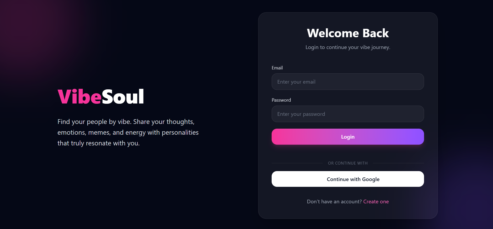
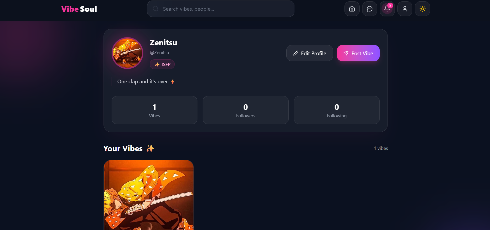
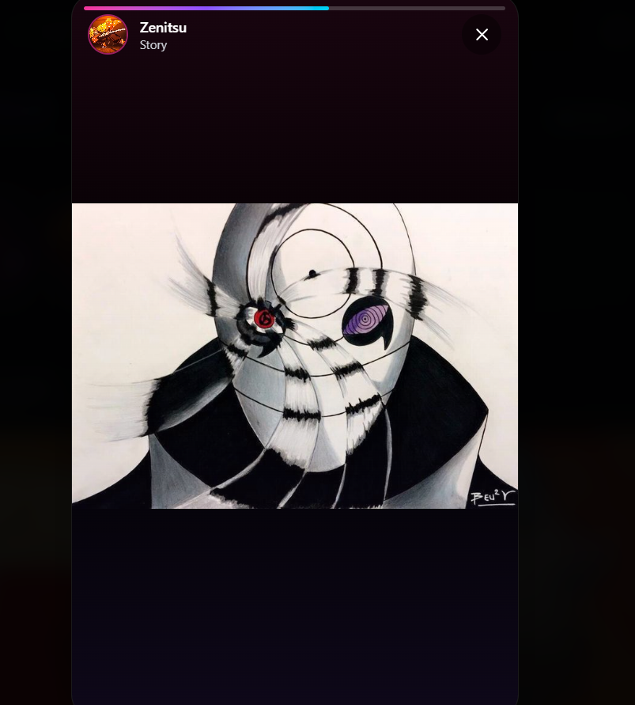
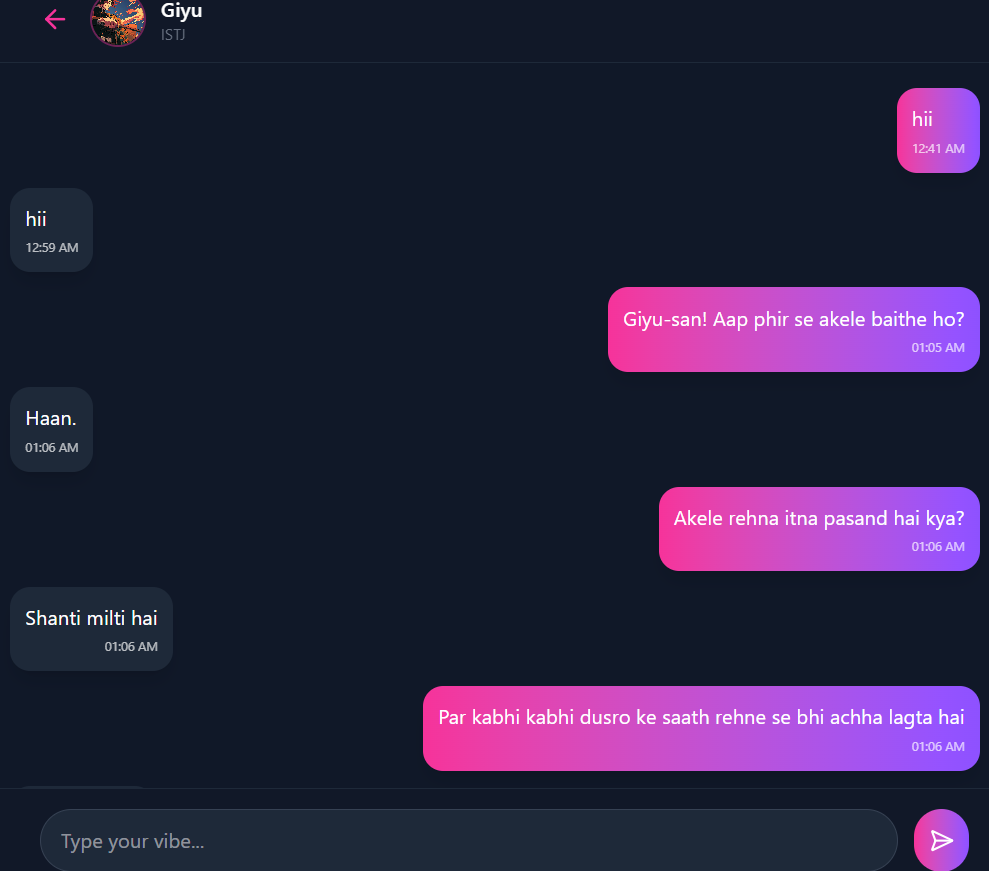
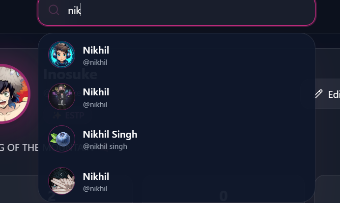

# VibeSoul 

VibeSoul is a personality-driven social media platform where users can express themselves through posts ("Vibes"), connect with others, share stories, follow friends, and build meaningful connections. Inspired by modern social platforms, VibeSoul focuses on self-expression and community engagement.

## ✨ Features
### 🔐 Authentication
- Email & Password Sign Up/Login
- Secure user authentication using Appwrite
- Protected routes
- Session management
  
### 👤 User Profiles
- Custom username
- Profile picture upload
- MBTI personality type support
- Bio/About section
- Edit profile functionality
- View user statistics
- 📝 Vibes (Posts)
- Create text posts
- Upload images
- Delete own posts
- Real-time feed updates
- View posts from all users

### ❤️ Engagement
- Like/Unlike vibes
- Comment on vibes
- Real-time interaction updates
- Notification system
- 👥 Social Features
- Follow/Unfollow users
- Followers & Following system
- User search
- Profile discovery

### 📖 Stories
- Create stories
- View stories from followed users
- Story previews
- Story expiration support

### 💬 Messaging
- Real-time chat
- Direct messaging
- User conversations

### 🔔 Notifications
- Like notifications
- Comment notifications
- Follow notifications
- Real-time updates

### 🔍 Search
- Live username search
- User discovery
- Fast search suggestions

## 🛠️ Tech Stack

### Frontend
- React.js
- Vite
- Tailwind CSS
- React Router
- Framer Motion

### Backend & Database
- Appwrite
- Appwrite Authentication
- Appwrite Database
- Appwrite Storage
- Appwrite Realtime

 ## 📂 Project Structure

```
 src/
├── appwrite/
│   ├── config.js
│   ├── auth.js
│   └── services/
│
├── components/
│   ├── Navbar.jsx
│   ├── StoryPreviewBar.jsx
│   ├── VibeCard.jsx
│   ├── CommentSection.jsx
│   └── ProtectedRoute.jsx
│
├── pages/
│   ├── Feed.jsx
│   ├── Profile.jsx
│   ├── EditProfile.jsx
│   ├── Search.jsx
│   ├── ChatScreen.jsx
│   ├── Login.jsx
│   └── Signup.jsx
│
├── utils/
├── hooks/
├── assets/
└── App.jsx
```

## Installation

### 1. Clone the Repository
```
git clone https://github.com/KAINNIKIHIL/vibesoul.git
cd vibesoul
```

### 2. Install Dependencies
```
npm install
```

### 3. Configure Environment Variables
```
VITE_APPWRITE_ENDPOINT=
VITE_APPWRITE_PROJECT_ID=
VITE_APPWRITE_DATABASE_ID=

VITE_APPWRITE_COLLECTION_ID=
VITE_APPWRITE_USERPROFILES_COLLECTION_ID=
VITE_APPWRITE_COMMENTS_COLLECTION_ID=
VITE_APPWRITE_LIKES_COLLECTION_ID=
VITE_APPWRITE_FOLLOWS_COLLECTION_ID=
VITE_APPWRITE_STORIES_COLLECTION_ID=
VITE_APPWRITE_CHATS_COLLECTION_ID=
VITE_APPWRITE_MESSAGES_COLLECTION_ID=
VITE_APPWRITE_NOTIFICATIONS_COLLECTION_ID=

VITE_APPWRITE_STORAGE_ID=
```

### 4. Start Development Server
```
npm run dev
```

## 🗄️ Database Collections

| Collection | Purpose |
|------------|----------|
| User Profiles | Stores user information such as username, bio, MBTI type, and profile picture |
| Vibes | Stores user posts |
| Comments | Stores comments on vibes |
| Likes | Stores likes on vibes |
| Follows | Stores follower-following relationships |
| Stories | Stores user stories |
| Chats | Stores chat conversations |
| Messages | Stores chat messages |
| Notifications | Stores user notifications |

## Future Enhancements

- Video vibes
- Voice notes
- MBTI compatibility matching
- AI-powered recommendations
- Group chats
- Dark/Light theme customization
- Content moderation tools
- Trending vibes section
- Hashtags & categories

  ## Screenshots
- Login Page
  
  
  
- Feed Page

  
  
- Profile Page

  
  
- Story Feature


  
- Chat Screen

  
  
- Search Page




 # 💜 About VibeSoul

## VibeSoul is more than just a social media platform—it's a place where personalities connect, stories are shared, and every vibe matters.

### "Share your vibe. Find your tribe." ✨
